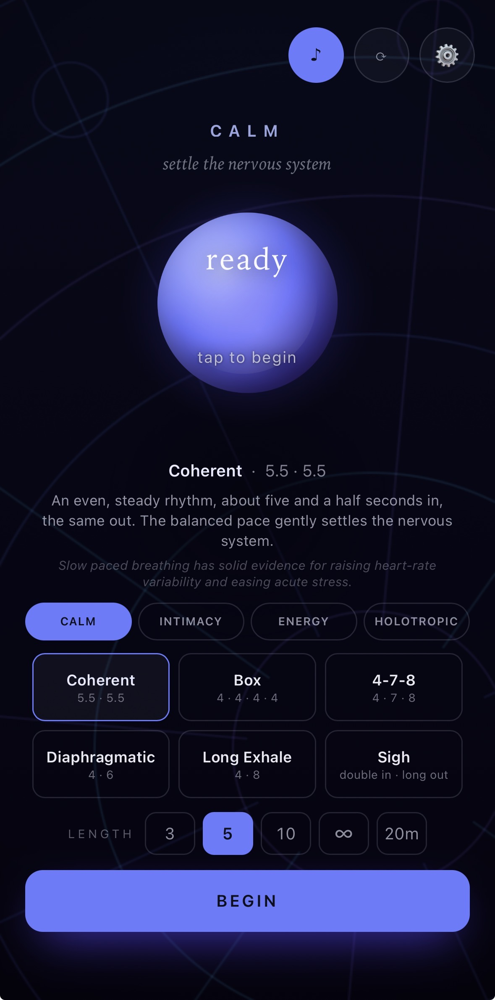
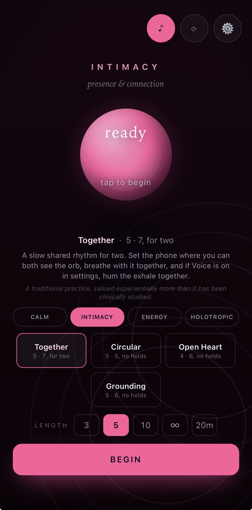
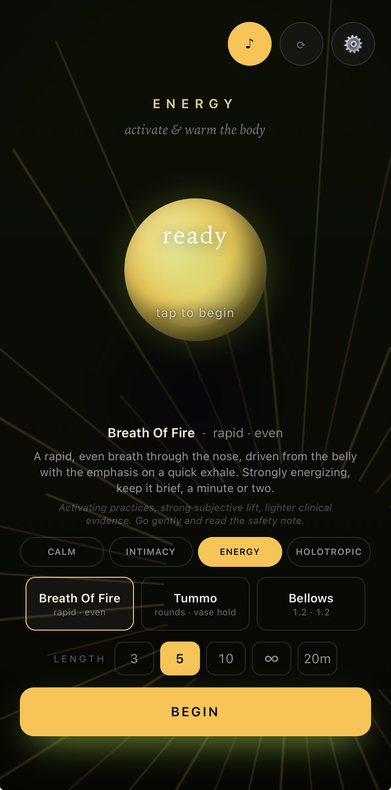
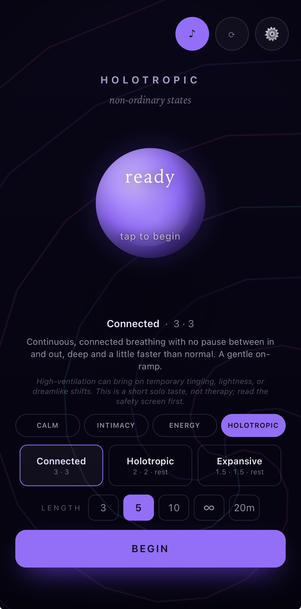
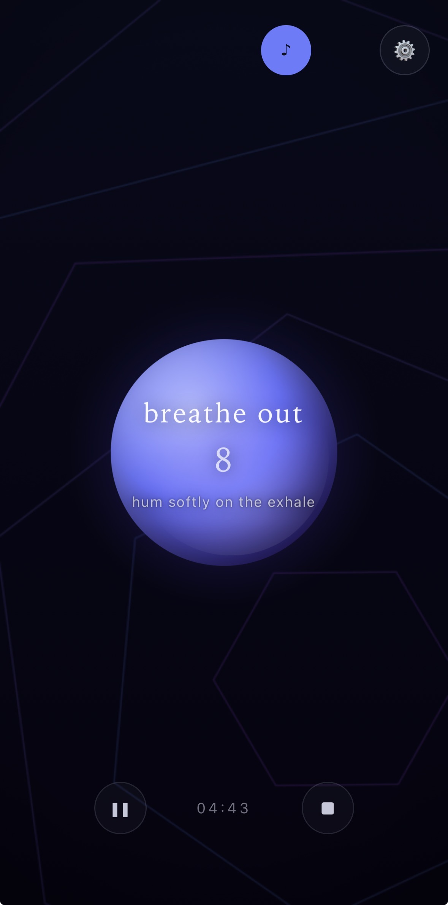

# Breath

A breathing pacer that runs entirely in your browser. One file, no account, no tracking, nothing to install.

**Live app:** https://hoatscs-droid.github.io/breath/

Breath paces you through slow and activating breathing practices with a single breathing orb, synthesized sound, and procedural visuals. Everything happens on your device. Nothing you do in the app ever leaves it.

## Screenshots

<table>
  <tr>
    <td width="20%" align="center" valign="top"> <strong>Calm</strong> Steady, settling breath.</td>
    <td width="20%" align="center" valign="top"> <strong>Intimacy</strong> Shared rhythms.</td>
    <td width="20%" align="center" valign="top"> <strong>Energy</strong> Brief activating practices.</td>
    <td width="20%" align="center" valign="top"> <strong>Holotropic</strong> Gated fast-breathing presets.</td>
    <td width="20%" align="center" valign="top"> <strong>Running</strong> The orb leads the session.</td>
  </tr>
</table>

## The practices

Four spaces, each with its own character and its own honesty note shown in the app:

- **Calm.** Slow, downshifting practices: Coherent (5.5 · 5.5), Box, 4-7-8, Long Exhale, Diaphragmatic, and the physiological Sigh (a double inhale followed by a long release).
- **Intimacy.** Soft connective practices such as Circular, Open Heart, and Grounding. Gentle pacing, no holds.
- **Energy.** Activating practices, including an accurate round-based Tummo (forceful rounds ending in a vase hold).
- **Holotropic.** Rounds of faster, fuller breathing followed by a still rest. Gated behind a safety screen, with a session length cap.

## Where the evidence stands

This app makes no health claims. It is a well-made pacing tool, not a medical device or a treatment.

Stated plainly: slow paced breathing, especially with a lengthened exhale, has solid published evidence for raising heart-rate variability and easing acute stress in the moment (Bernardi et al. 2001; Zaccaro et al. 2018; Lehrer and Gevirtz 2014). Five minutes a day of cyclic sighing outperformed mindfulness meditation for mood and respiratory rate in a 2023 controlled trial (Balban et al., Cell Reports Medicine). Tummo's round structure follows Kozhevnikov et al. 2013. Other practices here, particularly in Intimacy, are carried more by tradition and felt experience than by trials, and the app says so where that is the case.

If a practice's evidence is thin, the app tells you. That honesty is the point.

## Sound

Every sound is synthesized live with the Web Audio API. There are no audio files in this repository.

- A breath-tracking wash that swells with the inhale and releases long and soft with the exhale, sagging gently at the tail like a sigh.
- Holds hush: during breath holds the sound settles toward quiet, because the pause is part of the practice.
- **Voice.** An optional synthesized voiced exhale (a soft closed-mouth hum, or a more open Om) that swells only on the out-breath, for Calm and Intimacy. Hum along with it.
- **Ambient beds.** Ocean, Rain, and a deep drone, all generated procedurally, sitting quietly under the practice.
- Warm fixed-pitch markers count the holds. A soft chime lands the end of a session.

## Features

- **Guided descent.** An optional pace mode for Calm that eases each breath slightly longer over the session, carrying you down gradually. Coherent's descent is capped so it stays near the well-studied resonance pace.
- **Clean endings.** Timed sessions are planned to a whole number of breath cycles, so the countdown reaches zero exactly as your final exhale completes, then eases into a short landing rest before letting you go.
- Tap the orb to begin, pause, and resume. Preset lengths or any custom number of minutes. Infinite mode.
- Installable as an app (add to home screen on iOS and Android) and works offline.
- Screen-lock friendly on iOS: audio survives the lock screen, with playback controls and interruption recovery.
- Haptic cues on Android. iOS Safari has no vibration API, so haptics are Android only.
- Visual quality settings for older phones.
- Preferences are stored in localStorage on your device. There are no analytics, no network requests, and no accounts.

## Safety

Activating practices (Energy, Holotropic) use fast breathing and breath holds, which can cause lightheadedness. The app gates these behind a safety screen. Sit or lie down, never practice in or near water or while driving, stop if you feel faint, and skip these practices if you are pregnant or have cardiovascular, respiratory, or seizure conditions. Nothing in this app is medical advice.

## Engineering

- A single self-contained `index.html`. Vanilla JavaScript, Web Audio, canvas.
- No frameworks, no build step, no dependencies, no external requests, no bundled assets.
- Readable top to bottom. Fork it, remix it, learn from it.

## License

MIT. See [LICENSE](LICENSE).

Inspired by traditional pranayama lineages and by apps like Breathwrk, as inspiration rather than equivalence. Built solo, with care, by [Corbin Hoats](https://github.com/hoatscs-droid).
